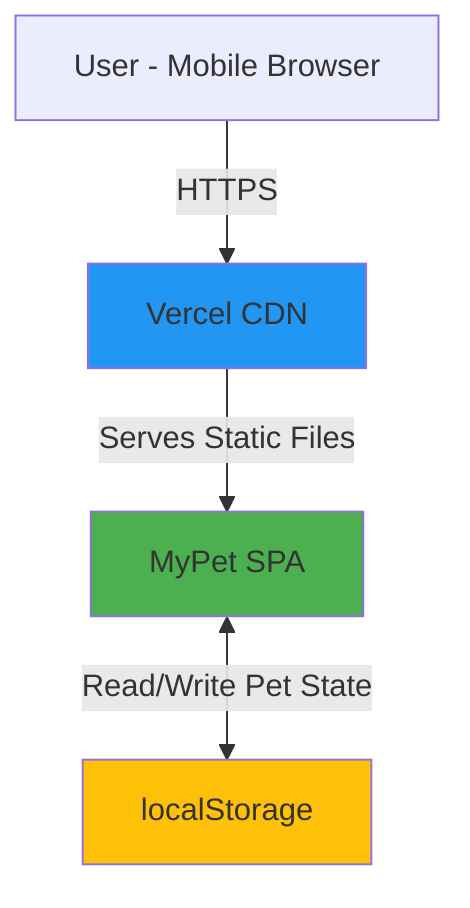
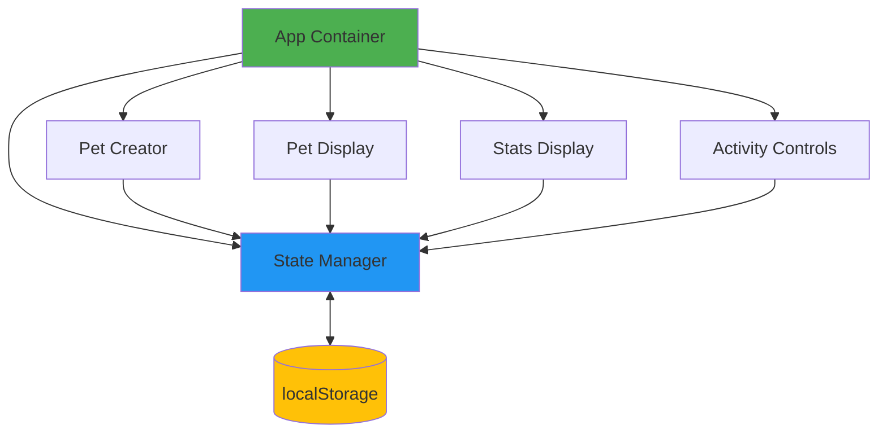
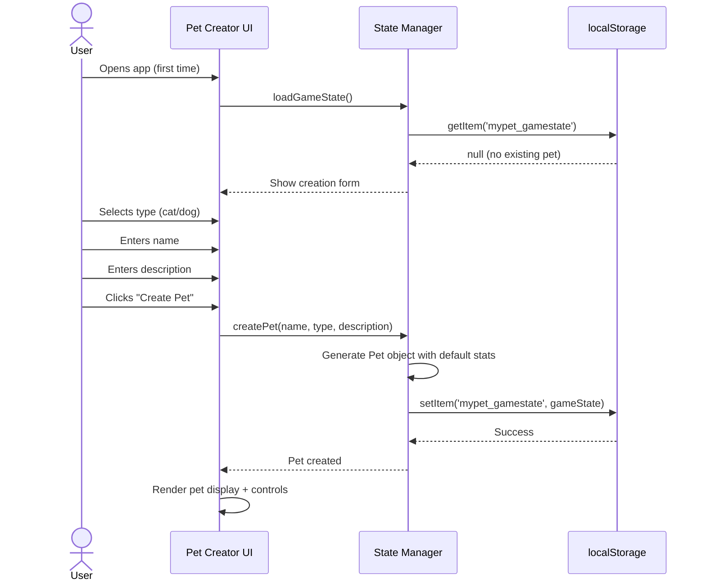
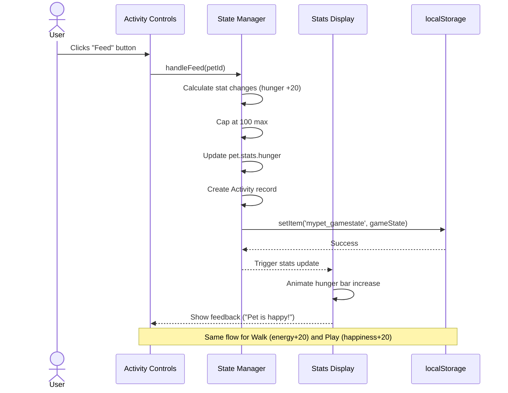
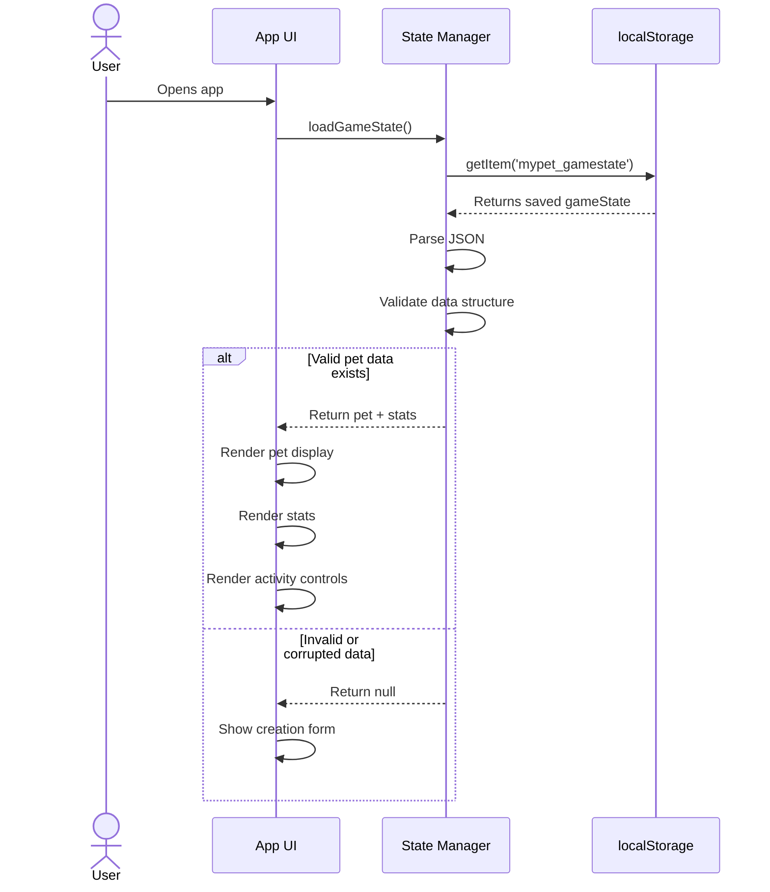

# MyPet Digital Pet App - Fullstack Architecture Document

## Introduction

This document outlines the complete fullstack architecture for MyPet Digital Pet App, including backend systems, frontend implementation, and their integration. It serves as the single source of truth for AI-driven development, ensuring consistency across the entire technology stack.

This unified approach combines what would traditionally be separate backend and frontend architecture documents, streamlining the development process for modern fullstack applications where these concerns are increasingly intertwined.

### Starter Template or Existing Project

**N/A - Greenfield project**

Given the 2-hour timeline and simple requirements, this project uses a **single HTML file approach** with vanilla JavaScript and no complex starter templates. This is the fastest path to deployment.

### Change Log

| Date | Version | Description | Author |
|------|---------|-------------|--------|
| 2025-10-17 | 0.1 | Initial architecture for MVP | Winston (Architect) |

---

## High Level Architecture

### Technical Summary

MyPet is a **stateless, client-side single-page application** deployed as static files. The app runs entirely in the browser with no backend infrastructure, using `localStorage` for session persistence. Users interact with a mobile-first web interface to create and care for their digital pet through simple activities (feed, walk, play). Pet visualization uses emoji/SVG icons for instant rendering. The architecture prioritizes **rapid development and zero-cost deployment** using static hosting platforms like Vercel, Netlify, or GitHub Pages.

### Platform and Infrastructure Choice

**Platform:** Vercel (Static Hosting)
**Key Services:** CDN (automatic), Edge Network (global)
**Deployment Host and Regions:** Global edge network (automatic)

**Rationale:** Zero-config deployment, instant deploys, automatic HTTPS, global CDN, and generous free tier perfect for MVP.

### Repository Structure

**Structure:** Single repository, flat structure
**Monorepo Tool:** N/A
**Package Organization:** Simple flat structure - all code in root or `/src`

```
mypet/
├── index.html
├── style.css
├── app.js
├── assets/
│   └── (pet icons/emojis if needed)
└── docs/
    └── architecture.md
```

### High Level Architecture Diagram



### Architectural Patterns

- **Static Site Architecture:** Single HTML page with embedded JS/CSS - _Rationale:_ Fastest development, zero backend complexity, instant deployment
- **Client-Side State Management:** Plain JavaScript objects with localStorage persistence - _Rationale:_ No framework overhead, simple to understand and debug
- **Mobile-First Responsive Design:** CSS media queries with touch-optimized UI - _Rationale:_ Primary use case is mobile, progressive enhancement for desktop
- **Session-Based Gaming:** Pet state only updates when user is active - _Rationale:_ Eliminates need for background processing or server-side timekeeping

---

## Tech Stack

This is the **definitive technology selection** for the entire project.

### Technology Stack Table

| Category | Technology | Version | Purpose | Rationale |
|----------|-----------|---------|---------|-----------|
| Frontend Language | JavaScript | ES6+ | Core application logic | No transpilation needed, runs natively in browsers, fastest setup |
| Frontend Framework | Vanilla JS | - | UI rendering | Zero setup time, no build step, perfect for simple MVP |
| UI Component Library | None | - | - | Manual DOM manipulation sufficient for MVP scope |
| State Management | Plain Objects + localStorage | - | Pet state persistence | Simplest possible approach, no dependencies |
| Backend Language | N/A | - | - | No backend needed for MVP |
| Backend Framework | N/A | - | - | Stateless client-side only |
| API Style | N/A | - | - | No API needed |
| Database | localStorage | Browser API | Client-side persistence | Built-in, zero setup, perfect for session data |
| Cache | Browser Cache | - | Static asset caching | Automatic via Vercel CDN |
| File Storage | N/A | - | - | No file uploads in MVP |
| Authentication | None | - | - | No accounts for MVP |
| Frontend Testing | Manual | - | Manual QA testing | Time-constrained MVP, automated tests post-launch |
| Backend Testing | N/A | - | - | No backend |
| E2E Testing | Manual | - | User acceptance testing | Manual verification sufficient for MVP |
| Build Tool | None | - | - | Direct file deployment for speed |
| Bundler | None (Optional: esbuild) | - | Optional JS minification | Can add if time permits |
| IaC Tool | None | - | - | Vercel manages infrastructure |
| CI/CD | Vercel Git Integration | - | Automatic deployment | Push to main = auto-deploy |
| Monitoring | Vercel Analytics | Free tier | Basic traffic monitoring | Built-in, zero config |
| Logging | Console + Vercel Logs | - | Error tracking | Browser console for dev, Vercel for production |
| CSS Framework | Custom CSS (or Tailwind CDN) | - | Styling | Custom CSS fastest, Tailwind CDN if you prefer utility classes |

---

## Data Models

### Pet Model

**Purpose:** Represents the user's digital pet with all its attributes and current state

**Key Attributes:**
- `id`: string - Unique identifier (timestamp-based)
- `name`: string - User-chosen pet name
- `type`: "cat" | "dog" - Pet species choice
- `description`: string - User's description of pet appearance
- `icon`: string - Emoji representation (🐱 or 🐶)
- `createdAt`: number - Timestamp of pet creation
- `stats`: object - Contains hunger, happiness, energy (0-100 each)

#### TypeScript Interface

```typescript
interface Pet {
  id: string;
  name: string;
  type: 'cat' | 'dog';
  description: string;
  icon: string;
  createdAt: number;
  stats: {
    hunger: number;    // 0-100
    happiness: number; // 0-100
    energy: number;    // 0-100
  };
}
```

#### Relationships

- None (single-player, one pet per session)

---

### Activity Model

**Purpose:** Tracks individual activities performed with the pet (for future analytics/history)

**Key Attributes:**
- `id`: string - Unique activity ID
- `petId`: string - Reference to pet
- `type`: "feed" | "walk" | "play" - Activity type
- `timestamp`: number - When activity occurred
- `impact`: object - How activity affected stats

#### TypeScript Interface

```typescript
interface Activity {
  id: string;
  petId: string;
  type: 'feed' | 'walk' | 'play';
  timestamp: number;
  impact: {
    hunger?: number;    // stat change amount
    happiness?: number;
    energy?: number;
  };
}
```

#### Relationships

- Belongs to one Pet (via `petId`)

---

### Game State Model

**Purpose:** Top-level application state container

**Key Attributes:**
- `currentPet`: Pet | null - Active pet (null if none created)
- `activityHistory`: Activity[] - Recent activities
- `lastPlayed`: number - Last session timestamp

#### TypeScript Interface

```typescript
interface GameState {
  currentPet: Pet | null;
  activityHistory: Activity[];
  lastPlayed: number;
}
```

#### Relationships

- Contains one Pet
- Contains multiple Activities

---

## API Specification

**N/A - No API for this MVP**

This is a fully client-side application with no backend services. All data operations are handled through browser localStorage.

---

## Components

### Pet Creator Component

**Responsibility:** Handles initial pet creation flow (type selection, naming, description input)

**Key Interfaces:**
- `createPet(name, type, description)` - Creates new pet and saves to state
- `validateInput(name, description)` - Basic input validation

**Dependencies:** GameState management functions

**Technology Stack:** Vanilla JS with DOM manipulation, CSS for styling

---

### Pet Display Component

**Responsibility:** Renders the current pet with its visual representation (icon/emoji) and description

**Key Interfaces:**
- `renderPet(pet)` - Displays pet information and icon
- `updatePetVisual(stats)` - Could show different expressions based on stats (future)

**Dependencies:** Pet data model

**Technology Stack:** Vanilla JS DOM updates, CSS animations for visual polish

---

### Stats Display Component

**Responsibility:** Shows current pet stats (hunger, happiness, energy) with visual indicators

**Key Interfaces:**
- `renderStats(stats)` - Displays stat bars/numbers
- `updateStat(statName, newValue)` - Updates individual stat display

**Dependencies:** Pet stats from game state

**Technology Stack:** Vanilla JS, CSS for progress bars or visual indicators

---

### Activity Controls Component

**Responsibility:** Provides interactive buttons for pet activities (Feed, Walk, Play)

**Key Interfaces:**
- `handleFeed()` - Increases hunger stat
- `handleWalk()` - Increases energy stat
- `handlePlay()` - Increases happiness stat
- `recordActivity(type)` - Saves activity to history

**Dependencies:** GameState update functions, Pet model

**Technology Stack:** Vanilla JS event listeners, button elements

---

### State Manager Component

**Responsibility:** Manages game state persistence to/from localStorage

**Key Interfaces:**
- `loadGameState()` - Retrieves state from localStorage
- `saveGameState(state)` - Persists state to localStorage
- `updatePetStats(petId, statChanges)` - Applies stat changes
- `resetGame()` - Clears state for new pet

**Dependencies:** localStorage API, all data models

**Technology Stack:** Vanilla JS with localStorage API

---

### Component Diagram



---

## External APIs

**No external APIs required for MVP**

This application is fully self-contained with no external service dependencies. All functionality runs client-side.

---

## Core Workflows

### Workflow 1: Create New Pet



### Workflow 2: Perform Activity (Feed/Walk/Play)



### Workflow 3: Return to App (Load Existing Pet)



---

## Database Schema

**N/A - No traditional database**

This application uses **browser localStorage** as its persistence layer. Data is stored as serialized JSON.

### localStorage Schema

**Key:** `mypet_gamestate`

**Value Structure (JSON):**

```json
{
  "currentPet": {
    "id": "1729180800000",
    "name": "Fluffy",
    "type": "cat",
    "description": "Orange tabby with white paws",
    "icon": "🐱",
    "createdAt": 1729180800000,
    "stats": {
      "hunger": 80,
      "happiness": 60,
      "energy": 70
    }
  },
  "activityHistory": [
    {
      "id": "1729180900000",
      "petId": "1729180800000",
      "type": "feed",
      "timestamp": 1729180900000,
      "impact": {
        "hunger": 20
      }
    }
  ],
  "lastPlayed": 1729180900000
}
```

---

## Frontend Architecture

### Component Architecture

#### Component Organization

```
src/
├── index.html          # Main HTML file
├── styles/
│   └── main.css        # All styles
├── js/
│   ├── app.js          # App initialization & routing
│   ├── state.js        # State management & localStorage
│   ├── components/
│   │   ├── petCreator.js    # Pet creation form
│   │   ├── petDisplay.js    # Pet visualization
│   │   ├── statsDisplay.js  # Stats bars
│   │   └── activityControls.js  # Action buttons
│   └── utils/
│       └── helpers.js  # Utility functions
```

#### Component Template

```typescript
// Example component structure (petDisplay.js)
const PetDisplay = {
  // Render the component
  render(pet) {
    const container = document.getElementById('pet-display');
    container.innerHTML = `
      <div class="pet-card">
        <div class="pet-icon">${pet.icon}</div>
        <h2 class="pet-name">${pet.name}</h2>
        <p class="pet-description">${pet.description}</p>
        <span class="pet-type">${pet.type}</span>
      </div>
    `;
  },

  // Update specific parts without full re-render
  update(pet) {
    document.querySelector('.pet-icon').textContent = pet.icon;
    document.querySelector('.pet-name').textContent = pet.name;
  },

  // Clean up if needed
  destroy() {
    const container = document.getElementById('pet-display');
    container.innerHTML = '';
  }
};

export default PetDisplay;
```

### State Management Architecture

#### State Structure

```typescript
// Global state object
const GameState = {
  currentPet: null,
  activityHistory: [],
  lastPlayed: Date.now(),

  // UI state (not persisted)
  ui: {
    currentView: 'loading', // 'loading' | 'create' | 'main'
    isAnimating: false
  }
};
```

#### State Management Patterns

- Single source of truth: One GameState object holds all application state
- Immutable updates: Create new objects instead of mutating (Object.assign or spread operator)
- Persistence layer: State manager handles localStorage sync
- Event-driven updates: State changes trigger component re-renders via pub/sub pattern
- Optimistic updates: UI updates immediately, localStorage saves asynchronously

### Routing Architecture

#### Route Organization

```
/ (root)
  ├── ?view=create    # Pet creation (if no pet exists)
  └── ?view=main      # Main game view (if pet exists)
```

Simple view switching based on game state - no router library needed.

#### Protected Route Pattern

```typescript
// Simple route guard
function initApp() {
  const gameState = StateManager.load();

  if (!gameState.currentPet) {
    showView('create');
  } else {
    showView('main');
  }
}
```

### Frontend Services Layer

#### Service Example

```typescript
// Current MVP: localStorage service
const StorageService = {
  STORAGE_KEY: 'mypet_gamestate',

  save(gameState) {
    try {
      const serialized = JSON.stringify(gameState);
      localStorage.setItem(this.STORAGE_KEY, serialized);
      return true;
    } catch (error) {
      console.error('Failed to save game:', error);
      return false;
    }
  },

  load() {
    try {
      const serialized = localStorage.getItem(this.STORAGE_KEY);
      return serialized ? JSON.parse(serialized) : null;
    } catch (error) {
      console.error('Failed to load game:', error);
      return null;
    }
  },

  clear() {
    localStorage.removeItem(this.STORAGE_KEY);
  }
};

export default StorageService;
```

---

## Backend Architecture

**N/A - No backend for MVP**

This is a fully client-side application with no server-side components.

---

## Unified Project Structure

```plaintext
mypet/
├── index.html                  # Main HTML entry point
├── styles/
│   └── main.css               # All styles (mobile-first)
├── js/
│   ├── app.js                 # App initialization & view routing
│   ├── state.js               # State management & localStorage
│   ├── components/
│   │   ├── petCreator.js      # Pet creation form component
│   │   ├── petDisplay.js      # Pet visualization component
│   │   ├── statsDisplay.js    # Stats bars component
│   │   └── activityControls.js # Activity buttons component
│   └── utils/
│       └── helpers.js         # Utility functions (format, validate, etc.)
├── assets/
│   └── icons/                 # Optional: additional pet icons/emojis
├── docs/
│   └── architecture.md        # This document
├── .gitignore                 # Git ignore (node_modules, .env, etc.)
├── vercel.json               # Vercel configuration (optional)
└── README.md                  # Project documentation
```

---

## Development Workflow

### Local Development Setup

#### Prerequisites

```bash
# Check Node.js installed (optional, only if using local dev server)
node --version  # v16+ recommended

# Or use Python's built-in server (no install needed)
python3 --version

# Or use VS Code Live Server extension (easiest)
```

#### Initial Setup

```bash
# Clone or create project
mkdir mypet
cd mypet

# Create directory structure
mkdir -p js/components js/utils styles assets docs

# Initialize git
git init

# Create .gitignore
echo "node_modules/
.DS_Store
.env
*.log" > .gitignore

# Create basic files
touch index.html styles/main.css js/app.js
```

#### Development Commands

```bash
# Option 1: Python simple server (no install needed)
python3 -m http.server 8000
# Visit: http://localhost:8000

# Option 2: Node.js http-server (install once)
npx http-server -p 8000

# Option 3: VS Code Live Server
# Install "Live Server" extension
# Right-click index.html → "Open with Live Server"

# No build step needed - just refresh browser!
```

### Environment Configuration

**None required for MVP!** Everything runs client-side with no API keys or secrets.

---

## Deployment Architecture

### Deployment Strategy

**Frontend Deployment:**
- **Platform:** Vercel (Static Hosting)
- **Build Command:** None required (no build step)
- **Output Directory:** `.` (root directory)
- **CDN/Edge:** Automatic via Vercel's global edge network

**Backend Deployment:**
- **N/A** (no backend)

**Deployment Process:**

1. Connect Git repo to Vercel
2. Vercel auto-detects static site
3. Every commit to main auto-deploys
4. Zero configuration needed

### Environments

| Environment | Frontend URL | Backend URL | Purpose |
|-------------|-------------|-------------|---------|
| Development | http://localhost:8000 | N/A | Local development |
| Preview | https://mypet-git-branch-*.vercel.app | N/A | PR preview deployments |
| Production | https://mypet.vercel.app | N/A | Live environment |

---

## Security and Performance

### Security Requirements

**Frontend Security:**
- **CSP Headers:** `default-src 'self'; style-src 'self' 'unsafe-inline'; script-src 'self'`
- **XSS Prevention:** Use `textContent` instead of `innerHTML` for user input
- **Secure Storage:** localStorage for non-sensitive data only

**Data Privacy:**
- All data stays local in user's browser
- No analytics tracking (unless Vercel Analytics enabled)
- No personal data collection
- GDPR-friendly by default

### Performance Optimization

**Frontend Performance:**
- **Bundle Size Target:** <50KB total (HTML + CSS + JS unminified)
- **Loading Strategy:** Single HTML file loads everything
- **Caching Strategy:** Browser cache + Vercel CDN

**Performance Targets:**
- **First Contentful Paint (FCP):** <0.5s
- **Largest Contentful Paint (LCP):** <1s
- **Time to Interactive (TTI):** <1s
- **Cumulative Layout Shift (CLS):** <0.1
- **First Input Delay (FID):** <100ms

---

## Testing Strategy

### Testing Pyramid

```
      E2E Tests (Manual)
           /  \
    Integration Tests (Manual)
         /      \
   Component Tests (Manual)
```

**For 2-hour MVP: All testing is manual**

### Manual Testing Checklist for MVP

**Pet Creation:**
- [ ] Can select cat
- [ ] Can select dog
- [ ] Can enter name (test max length)
- [ ] Can enter description
- [ ] Create button works
- [ ] Transitions to main view

**Pet Display:**
- [ ] Shows correct icon (🐱 or 🐶)
- [ ] Shows name
- [ ] Shows description
- [ ] Renders on mobile viewport

**Activities:**
- [ ] Feed button increases hunger
- [ ] Walk button increases energy
- [ ] Play button increases happiness
- [ ] Stats cap at 100
- [ ] Visual feedback on click

**Persistence:**
- [ ] Reload page, pet still there
- [ ] Close tab, reopen, pet still there
- [ ] Clear localStorage, shows creation form

**Mobile:**
- [ ] Test on actual mobile device
- [ ] Touch targets are large enough (44x44px minimum)
- [ ] Text is readable
- [ ] No horizontal scroll

---

## Coding Standards

### Critical Fullstack Rules

- **Input Sanitization:** Always escape user input before rendering to DOM. Use `textContent` for strings, never `innerHTML` with unsanitized data
- **State Updates:** All state changes must go through StateManager - never directly mutate `gameState` object
- **localStorage Access:** Only access localStorage through StorageService wrapper - handles errors gracefully
- **Stat Boundaries:** Always clamp stats to 0-100 range using `Math.min(100, Math.max(0, value))`
- **DOM Queries:** Cache frequently-used selectors in variables - don't query DOM repeatedly in loops
- **Error Handling:** Wrap localStorage operations in try-catch - quota can be exceeded or disabled
- **Naming Consistency:** Use same terminology everywhere: "pet" not "animal", "stats" not "attributes"

### Naming Conventions

| Element | Frontend | Backend | Example |
|---------|----------|---------|---------|
| Components | PascalCase | - | `PetCreator`, `StatsDisplay` |
| Functions | camelCase | - | `createPet()`, `updateStats()` |
| Variables | camelCase | - | `currentPet`, `gameState` |
| Constants | UPPER_SNAKE_CASE | - | `STORAGE_KEY`, `MAX_STAT_VALUE` |
| CSS Classes | kebab-case | - | `.pet-card`, `.stat-bar` |
| Data Attributes | kebab-case | - | `data-pet-type`, `data-action` |
| File Names | camelCase | - | `petCreator.js`, `statsDisplay.js` |

---

## Error Handling Strategy

### Error Response Format

```typescript
interface AppError {
  code: string;           // ERROR_STORAGE_FULL, ERROR_INVALID_INPUT
  message: string;        // User-friendly message
  details?: any;          // Additional debug info
  timestamp: number;      // When error occurred
  recoverable: boolean;   // Can user retry?
}
```

### Key Error Types

- **STORAGE_FULL:** localStorage quota exceeded - show clear message to user
- **STORAGE_DISABLED:** localStorage disabled in browser - prompt to enable
- **INVALID_STAT:** Invalid stat update - show retry option
- **CORRUPTED_DATA:** Save data corrupted - reset gracefully and inform user

### Error Handling Pattern

```typescript
try {
  localStorage.setItem(key, value);
} catch (error) {
  if (error.name === 'QuotaExceededError') {
    showError('Unable to save. Please clear browser data.');
  } else {
    showError('Unable to save. Please try again.');
  }
}
```

---

## Monitoring and Observability

### Monitoring Stack

- **Frontend Monitoring:** Vercel Analytics (free tier) - Basic page views, performance metrics
- **Backend Monitoring:** N/A (no backend)
- **Error Tracking:** Browser console + Vercel Runtime Logs
- **Performance Monitoring:** Chrome Lighthouse, Web Vitals via Vercel

### Key Metrics

**Frontend Metrics:**
- Core Web Vitals (LCP, FID, CLS)
- JavaScript errors (console monitoring)
- Page load time
- User interactions (manual tracking)

**Business Metrics (Manual tracking for MVP):**
- Pets created
- Activities performed
- Return visits

---

## Summary

This architecture document defines a **minimal, pragmatic MVP** for the MyPet digital pet app:

- **Stateless client-side app** with no backend complexity
- **localStorage persistence** for session-based gameplay
- **Vanilla JavaScript** for zero setup time and maximum speed
- **Vercel deployment** for instant, global, free hosting
- **Mobile-first design** optimized for touch interactions
- **2-hour build timeline** achievable with this architecture

The architecture is designed to be **extended post-MVP** with features like:
- Backend API for multi-device sync
- User accounts and authentication
- AI-generated pet images
- Multiplayer features
- Advanced animations and interactions

**Total estimated code:** ~600-800 lines across all files

**Time breakdown:**
- Setup: 5 minutes
- Pet creation: 30 minutes
- Stats display: 20 minutes
- Activities: 25 minutes
- Styling: 25 minutes
- Testing: 10 minutes
- Deployment: 5 minutes
- **Total: ~120 minutes (2 hours)**

---

*Generated by Winston (Architect Agent) - 2025-10-17*
